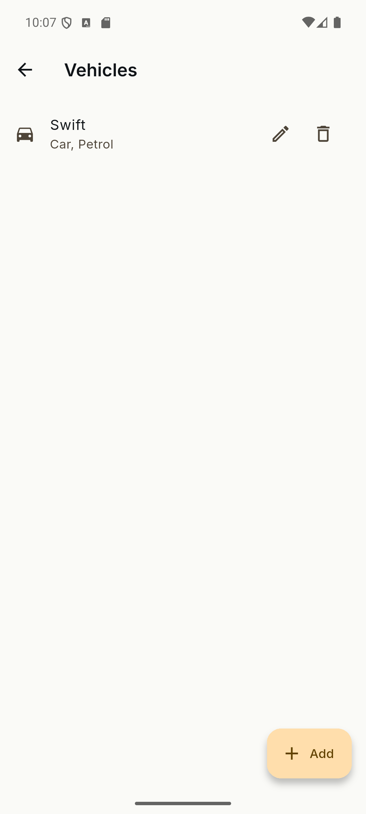
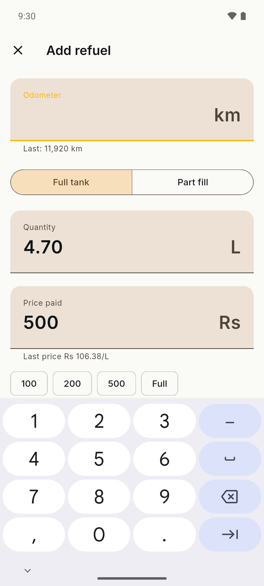
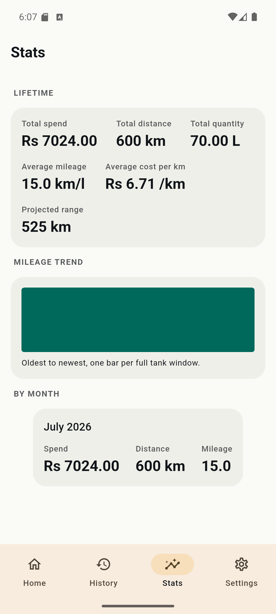

# OdoLog

A fuel log for your vehicles. Log every refuel, get mileage and running costs you can trust.

[](https://github.com/jinxk/odolog/actions/workflows/ci.yml)
[](LICENSE)
[](https://flutter.dev)
[](#)

OdoLog is a small app that does one thing well: it tells you what your vehicles actually cost to run. You add a vehicle, log each refuel at the pump in under fifteen seconds (quantity, amount paid, odometer), and the app works out your real mileage, cost per kilometre, range per tank, and monthly spend. The mileage math is measured the honest way, full tank to full tank, so the numbers are ones you can rely on rather than a confident guess.

It is 100% offline. No account, no cloud, no ads, no analytics. Your data lives in a local SQLite database on the device and nowhere else.

## Screenshots

Screenshots coming with the first release. The layout below is where they will go.

<!--
<table>
  <tr>
    <td></td>
    <td></td>
    <td></td>
  </tr>
</table>
-->

## Features

Present today (early development):

- Add and manage multiple vehicles.
- Log every refuel: quantity, amount paid, odometer reading.
- Optional per refuel: fuel variant (XP95, Shell V-Power, and the rest), station, notes, and a full or partial tank flag.
- Real mileage computed full tank to full tank (km/l, or km/kg for CNG).
- Cost per kilometre, range per tank, and monthly spend.
- India-first fuel presets: IOCL, BPCL, HPCL, Shell, Nayara, Jio-bp variants, CNG, and Auto LPG. Free text entry works too, so the app is usable anywhere.
- Material 3 interface with dark and light themes.

Fuel variant is remembered per vehicle, so most refuels are just quantity, amount, odometer, save.

See the [Roadmap](#roadmap) for what is planned.

## How the math works

The one number this app cannot get wrong is mileage. So it only computes mileage between two full tanks.

When you fill to full, the app knows exactly how much fuel was burned to get from the last full tank to this one, and it knows the distance from the odometer. Partial fills in between are still logged, they just do not produce a mileage figure on their own, because the app cannot know how much fuel you actually used since the last reading. It waits for the next full tank and computes across the whole interval. This is the standard way to measure real consumption, and it is why the numbers are trustworthy.

A worked example. Three fills, all full tank:

| Fill | Odometer (km) | Fuel added (L) | Distance since last full | Mileage |
| ---- | ------------- | -------------- | ------------------------ | ------- |
| 1    | 10,000        | (baseline)     | n/a                      | n/a     |
| 2    | 10,420        | 28.0           | 420 km                   | 15.0 km/l |
| 3    | 10,865        | 30.5           | 445 km                   | 14.6 km/l |

The first full tank is only a baseline; there is nothing before it to measure against. From the second fill on, mileage is distance since the last full tank divided by the fuel it took to fill back up: 420 / 28.0 = 15.0 km/l. CNG uses the same rule with mass, giving km/kg.

## Getting started

You will need:

- Flutter, stable channel.
- Android SDK with a recent platform installed.

Build from source:

```bash
git clone https://github.com/jinxk/odolog.git
cd odolog
flutter pub get
dart run build_runner build --delete-conflicting-outputs
flutter run
```

The `build_runner` step is not optional. Riverpod providers and a few other classes are generated, and the app will not compile without the generated files. If you are changing annotated code, keep a watcher running instead:

```bash
dart run build_runner watch --delete-conflicting-outputs
```

Android is the primary target. iOS should build but is untested.

## Project structure

The code follows Clean Architecture in three layers, with the dependency rule pointing inward.

```text
lib/
  domain/        pure Dart entities, use cases, repository interfaces (no Flutter)
  data/          SQLite, repository implementations, fuel variant catalog
  presentation/  widgets, Riverpod providers, go_router, Material 3 theme
```

Keeping the domain layer free of Flutter is what lets the mileage math be tested without an emulator. For the full picture, see [docs/architecture.md](docs/architecture.md).

## Roadmap

- **v0.1** (current focus): vehicles, refuel log, and the core stats (mileage, cost per km, range per tank, monthly spend).
- **v0.2**: charts, plus CSV and JSON export and import. Export matters here: since data lives only on the device, it is your backup.
- **Later**: more locales and fuel presets beyond India, and an iOS release once it is properly tested.

## Contributing

Contributions are welcome. Read [CONTRIBUTING.md](CONTRIBUTING.md) to get started, and [docs/architecture.md](docs/architecture.md) for how the code is laid out.

Fuel presets for other countries are a good first pull request: they are self contained, low risk, and make the app useful in more places.

## License

MIT. See [LICENSE](LICENSE).
